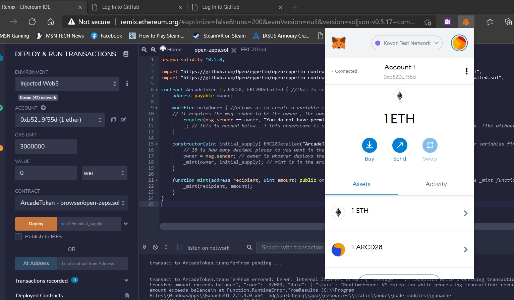
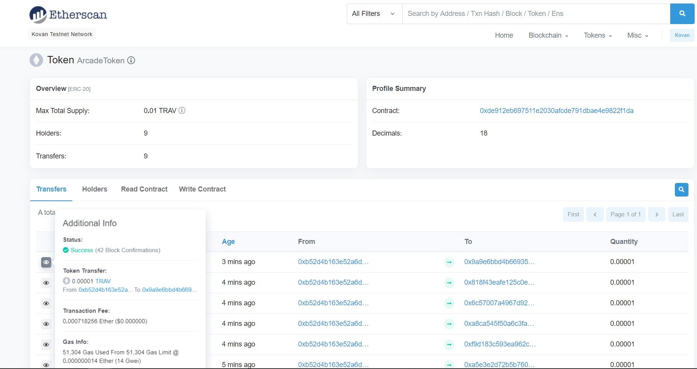

# Solidity-contracts
solidity contract code bases. see gist's as well: https://gist.github.com/VRkaavar as remix allows us to upload quickly. also used kovan testnet 

- - -

we'll use this repo to host .sol contracts created using the following tools

- - -

and certainly Ganache as our blockchain for contract placement

